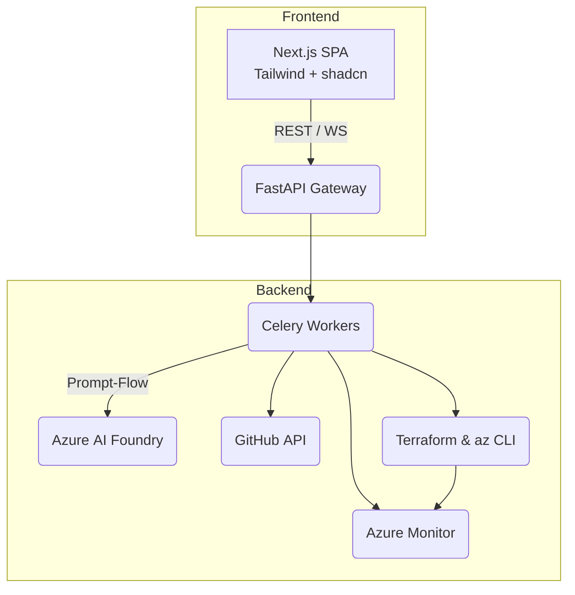

# DevOps AI Assistant

An **end‑to‑end platform engineer in a box**: a slick **Next.js 15 front‑end** backed by **FastAPI** services plus an **Azure AI Foundry, Celery, and Terraform engine**. It can *scan*, *explain*, and *fix* any GitHub repo, then ship or repair workloads on Azure (Container Apps, AKS, App Service, Functions).

> **Goal** Give every DevOps or App Engineer an opinionated autopilot that enforces best practice (CUPID, SOLID, least‑privilege) while keeping humans in the PR loop.

---

## 🚀 Key Abilities  

| Capability           | What Happens                                                                                                                             | Tooling                                                 |
| -------------------- | ---------------------------------------------------------------------------------------------------------------------------------------- | ------------------------------------------------------- |
| **Scan & Lint**      | Clones repo, maps Terraform / Docker / YAML, runs static linters, then feeds results to GPT‑4o for a concise human report                | tfsec, Checkov, Trivy, kube‑linter, Foundry prompt‑flow |
| **Fill Gaps**        | Detects missing artefacts (Dockerfile, IaC, CI) → injects language‑aware blueprints with project‑specific placeholders filled by the LLM | Blueprint library + Jinja2 templates                    |
| **Plan Preview**     | Generates cost estimate, infra diagram, and side‑by‑side diff so teams can cherry‑pick fixes                                             | Infracost, Mermaid                                      |
| **PR & Auto‑Deploy** | Opens PR; merge triggers Terraform plan/apply and `az containerapp update` via GitHub Actions                                            | Terraform, az CLI, Helm                                 |
| **Live Metrics**     | Reads Azure Monitor & Application Insights, correlates runtime errors with config issues                                                 | Azure Monitor Query SDK                                 |

---

## 🏗 High‑Level Architecture



**Workflow**  Frontend wizard collects repo + target info → Gateway spawns background job → Worker loops *analyse → generate → validate → report* until user approves, then applies.

---

## 🧰 Tech Stack & Versions

* **UI** Next.js 15, React Server Components, shadcn/ui  |  Tailwind 3.4
* **API** FastAPI 0.111, Uvicorn 0.30, Authlib 1.4, Redis 7
* **Jobs** Celery 5.4 + KEDA autoscaler (HPA on AKS)
* **AI** Azure OpenAI GPT‑4o orchestrated by Foundry Prompt‑Flow 1.x
* **IaC** Terraform 1.8, Helm 3.14, Docker 24
* **Security / Lint** tfsec 1.x, Checkov 3.x, Trivy 0.50, kube‑linter 0.6
* **Observability & Secrets** Azure Monitor, Application Insights, Key Vault

---

## ⚡ Local Dev Bootstrap

```bash
# 1 Install deps
pnpm i && pip install -r requirements.txt

# 2 Run services in parallel
pnpm dev & \
uvicorn gateway.main:app --reload & \
celery -A worker.celery_app worker -l info & \
redis-server &

# 3 Add .env (see .env.sample)
export GITHUB_CLIENT_ID=xxx
export OPENAI_API_KEY=azure‑openai‑key
# ...
```

Open **[http://localhost:3000](http://localhost:3000)** → follow wizard.

### Dockerised One‑liner

```bash
docker compose up --build  # ui, api, worker, redis
```

---

## 🗂 Recommended Folder Structure

```
.
├── gateway/                  # FastAPI gateway (RSC ← SVC ← EXT)
│   ├── main.py               # FastAPI instance & middleware wiring
│   ├── config.py             # Pydantic Settings (12‑factor) 🔑
│   ├── core/                 # Cross‑cutting helpers (no deps outward)
│   │   ├── logging.py        # structlog / OpenTelemetry setup
│   │   ├── exceptions.py     # Problem‑details & error mappers
│   │   └── security.py       # JWT, OAuth utils (pure functions)
│   ├── app/
│   │   ├── auth/             # ⤵ Feature vertical – SOLID boundary
│   │   │   ├── controller/   #   ↳ FastAPI routers (HTTP)
│   │   │   │   └── auth_controller.py
│   │   │   ├── service.py    #   ↳ Business logic, calls ports
│   │   │   └── schemas.py    #   ↳ DTOs (Pydantic models)
│   │   ├── services/
│   │   │   └── cloudassist/
│   │   │       ├── controller/
│   │   │       │   └── chat_router.py
│   │   │       ├── service.py    # LLM orchestration facade
│   │   │       └── ports.py      # Abstract ports (GitHubPort, AzurePort)
│   │   └── shared/          # reusable deps for DI (e.g. current_user)
│   │       └── middleware/
│   │           ├── auth_middleware.py
│   │           └── request_id.py
│   └── tests/
│       ├── unit/
│       └── e2e/
├── worker/                   # Heavy Celery jobs
│   ├── celery_app.py         # Celery configuration + OpenTelemetry
│   ├── tasks/
│   │   ├── repo_scan.py
│   │   └── deploy.py
│   └── ai/
│       ├── prompt_flows/     # Azure Foundry .flow.json
│       └── tools/            # low‑level Git/Azure helpers
├── scripts/                  # Bash automation (SRP per file)
│   ├── _lib/common.sh        # colours, log(), trap ‑ shared
│   ├── init-azure.sh
│   ├── build-push.sh
│   ├── deploy-aca.sh
│   └── destroy.sh
├── blueprints/               # Template library (Docker, TF, CI)
├── infra/                    # Terraform to bootstrap platform
│   └── modules/
├── logs/                     # Local log output (git‑ignored)
└── docs/                     # ADRs, sequence diagrams, runbooks
```

**CUPID & SOLID notes**

* **Coherent**: each *feature* (auth, cloudassist) sits in its own sub‑package; internal changes never ripple.
* **Unix‑philosophy**: scripts do *one thing*; Python modules do *one reason to change*.
* **Predictable**: imports only point inward (controllers → services → ports). No circular deps; exts live at edges.
* **Idempotent**: Bash scripts & Terraform are safe to re‑run.
* **Documented**: every public function / script has a 1‑line docstring & example.

### 📓 Logging Best Practices

1. **Structlog JSON** ‑ machine‑readable in prod; pretty colours in dev.
2. **Request / Correlation ID** middleware adds `x-request-id` header; propagated into Celery via job kwargs.
3. **Central sinks**

   * ACA → Log Analytics by default.
   * AKS → fluent‑bit → Log Analytics.
4. **Severity budget**: `logger.debug` for linter output, `info` for user transitions, `warning` for retries, `error` for uncaught.
5. **Tracing**: `opentelemetry-instrumentation-fastapi` & `opentelemetry-instrumentation-celery` push traces to Azure Monitor.

---

## 📝 Logging & Tracing

* Local dev: colourised console (`core/logging.py`)
* Prod: JSON to Stdout → Container Apps / Fluent Bit → Log Analytics
* Each request carries `X‑Request‑ID` + `X‑Job‑ID`; workers propagate via structured logs so Kibana/Grafana dashboards can reconstruct a full trace.
* Integrated **OpenTelemetry** exporter ready for Azure Monitor or Jaeger.

---

## ✅ Testing & CI

| Layer           | Tool                        | Trigger    |
| --------------- | --------------------------- | ---------- |
| Unit tests      | pytest ＋ FastAPI TestClient | push / PR  |
| Static analysis | ruff, mypy                  | push / PR  |
| IaC checks      | tfsec, Checkov, Infracost   | PR comment |
| e2e             | Playwright (UI)             | nightly    |

---

## 📦 Production Release

1. `scripts/init-azure.sh` – create resource group & ACR
2. GitHub Actions pushes image → ACR
3. `scripts/deploy-aca.sh` – ACA env + revision rollout
4. KEDA scales workers off queue length; metrics auto‑ingested.

---

## 🛣 Roadmap

* AWS/GCP targets via modular blueprint sets
* Drift detection scheduler (nightly compare Terraform state ↔ cloud)
* Chat overlay on PR diff for inline AI commentary
* Fine‑grained RBAC & policy packs via OPA/Gatekeeper

---

## 🤝 Contributing

* Fork, create feature branch <kbd>git checkout -b feat/x</kbd>
* `pnpm format && ruff format` then commit
* Open PR – CI runs full scan & e2e
* Use **Conventional Commits** for autom. release notes

---

MIT © 2025 Collins Munene & Contributors
